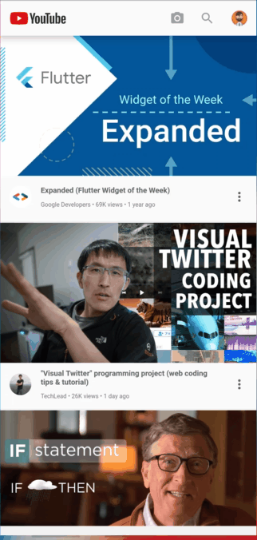
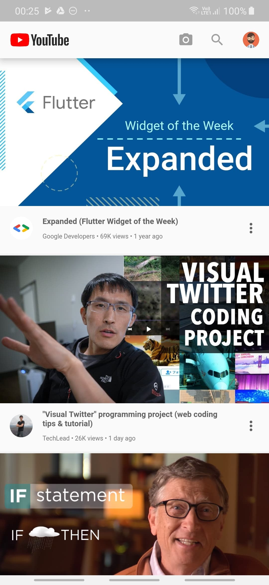
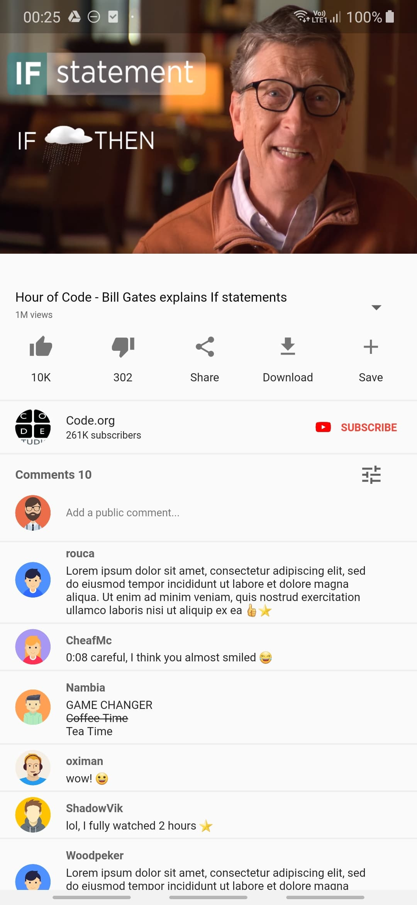

<a name="readme-top"></a>


<!-- PROJECT LOGO -->
<br />
<div align="center">
  
  <h3 align="center">Youtube-Clone</h3>
  <p align="center">
    A visual YouTube app clone made in Flutter for
    <br />learning purposes, with components including
    <br />homepage video list, video author details,
    <br />and video details.
    <br /><br />
  </p>
</div>


<!-- TABLE OF CONTENTS -->
<details>
  <summary>Table of Contents</summary>
  <ol>
    <li>
      <a href="#about-the-project">About The Project</a>
      <ul>
        <li><a href="#built-with">Built With</a></li>
      </ul>
    </li>
    <li>
      <a href="#getting-started">Getting Started</a>
      <ul>
        <li><a href="#installation">Installation</a></li>
      </ul>
    </li>
    <li><a href="#usage">Usage</a></li>
    <li><a href="#license">License</a></li>
  </ol>
</details>


<!-- ABOUT THE PROJECT -->
## About The Project

This project is a visual YouTube app clone made in Flutter for learning purposes. The main goal was to build an app that emulates the core features of the YouTube app. All the data displayed in the app is mocked with fake data and no real data is fetched.

As my first project in Flutter, I created this app to learn and practice the basics of building a mobile application with Flutter. The project gave me the opportunity to gain hands-on experience with Flutter widgets, navigation, HTTP requests, and more.

Although the app is not intended for production use, it serves as a valuable learning resource for those who are new to Flutter or mobile app development in general.

<p align="right">(<a href="#readme-top">back to top</a>)</p>


### Built With

![Flutter][Flutter-url]
![Dart][Dart-url]

<p align="right">(<a href="#readme-top">back to top</a>)</p>


<!-- GETTING STARTED -->
## Getting Started

To get a local copy up and running follow these simple steps.

### Installation

1. Clone the repo
   ```sh
   git clone git@github.com:kamillobinski/youtube-clone.git
   ```

2. Open the cloned repository in Android Studio or any other code editor

3. Install the necessary dependencies by running the following command in the terminal
   ```sh
   flutter pub get
   ```

4. Once the dependencies are installed, you can run the app on an emulator or a physical device using the following command
   ```
   flutter run
   ```

<p align="right">(<a href="#readme-top">back to top</a>)</p>


<!-- USAGE -->
## Usage

Here are some previews of the app's main features:

| All | Homepage | VideoPage |
|   ---  |  ---  |  ---  |
|   |  |  | 

<p align="right">(<a href="#readme-top">back to top</a>)</p>


<!-- LICENSE -->
## License

Distributed under the Apache 2.0 License. See `LICENSE` for more information.

<p align="right">(<a href="#readme-top">back to top</a>)</p>


<!-- MARKDOWN LINKS & IMAGES -->
[Flutter-url]: https://img.shields.io/badge/Flutter-%2302569B.svg?style=for-the-badge&logo=Flutter&logoColor=white
[Dart-url]: https://img.shields.io/badge/dart-%230175C2.svg?style=for-the-badge&logo=dart&logoColor=white